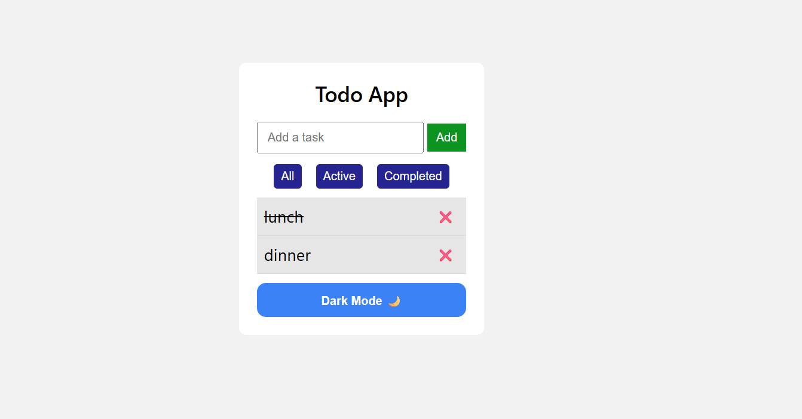

# 📝 Todo App (React)

A modern and interactive Todo application built with React, featuring persistent storage, filtering, and a clean UI with dark mode support.

---

## 🚀 Features

* ➕ Add new tasks
* ✅ Mark tasks as completed
* ❌ Delete tasks
* 🔍 Filter tasks (All / Active / Completed)
* 🌙 Dark mode toggle
* 💾 Persistent storage using localStorage (data remains after refresh)

---

## 🧠 What I Learned

* Managing complex state using React Hooks (`useState`, `useEffect`)
* Handling lists and updating arrays in React
* Component-based architecture and prop drilling
* Conditional rendering and filtering logic
* Persisting data in the browser using localStorage
* Structuring a scalable React project

---

## 🛠️ Tech Stack

* React (with Vite)
* JavaScript (ES6+)
* CSS (inline styling)

---

## 📁 Project Structure

```
src/
  components/
    TodoInput.jsx     // Input field to add tasks
    TodoList.jsx      // Displays list of todos
    TodoItem.jsx      // Individual todo item
    ThemeToggle.jsx   // Dark/light mode toggle
  App.jsx             // Main app logic and state
```

---

## ▶️ Getting Started

Clone the repository and run locally:

```bash
npm install
npm run dev
```

---

## 📸 Preview



---

## ✨ Future Improvements

* ✏️ Edit existing tasks
* 🧹 Clear completed tasks
* 🎨 Enhanced UI with animations
* 📱 Improved responsiveness for mobile devices

---

## 📌 Notes

This project is part of my learning journey in React, focusing on building real-world applications with clean structure and reusable components.

---

## 🔗 Live Demo

(Add your deployed link here — e.g., Vercel or Netlify)

---

## 🙌 Acknowledgements

Inspired by common real-world Todo applications, built from scratch to strengthen core React concepts.
